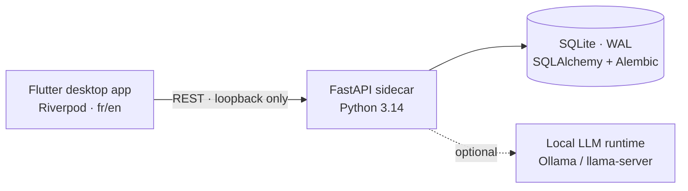

<div align="center">

# Bastide

**A local-first personal finance manager for the desktop.**
Import your bank statements, see where your money goes, and keep your data on your machine.

[](https://github.com/opierre/FinStride/actions/workflows/ci.yml)


🇫🇷 French first · 🇬🇧 English

</div>

> [!IMPORTANT]
> **Your data never leaves your computer.** There are no bank connections, no cloud account and
> no telemetry. The backend listens on `127.0.0.1` only, and the optional AI runs on a local
> model.

## ✨ Features

| | |
|---|---|
| 📥 **Imports** | OFX/QFX statements, routed to the right account by its bank id, with deduplication and an import history that flags balance mismatches. |
| 📊 **Dashboard** | Monthly income and expenses, month-over-month trend, savings rate, and a breakdown by category. |
| 🏷️ **Categorisation** | Deterministic rules first, then an optional local model for the rest. Uncertain guesses go to a review queue, and a correction can become a rule. |
| 🔁 **Subscriptions** | Recurring charges detected automatically, including price changes and missed payments. |
| 🎯 **Goals** | Virtual savings envelopes that track progress without moving any money. |
| 🏠 **Patrimoine** | Mortgages with derived amortisation schedules and the debt ratio, a new-loan simulator against the HCSF limits, and a net-worth view across accounts, properties and loans. |
| 💾 **Backup** | Export everything to one `.bastide` file and restore it anywhere. |

## 🚀 Quick start

> [!NOTE]
> You need [uv](https://docs.astral.sh/uv/) and the [Flutter SDK](https://docs.flutter.dev/get-started/install)
> with desktop support enabled for your OS.

```bash
# 1 · backend — the local API sidecar
cd backend
uv sync
uv run alembic upgrade head
uv run uvicorn app.main:app --host 127.0.0.1 --port 8765 --reload

# 2 · frontend — in a second terminal
cd frontend
flutter pub get
flutter run -d windows   # or macos / linux
```

> [!TIP]
> **AI categorisation is optional.** Run [Ollama](https://ollama.com) or `llama-server` with a
> small model (Gemma 4 E4B by default), then switch it on under **Paramètres → Données → IA
> locale**. Without a model, the rules still categorise everything they match, and the rest goes
> to the review queue.

With the backend running, interactive API docs are served at <http://127.0.0.1:8765/docs>.

## 🧱 How it works



- **Money is integer minor units**, and rates are integer basis points. Floats are never used.
- **Derived figures are not stored.** Amortisation schedules, simulations and net worth are
  computed from what you declared, so they can't go out of sync with it.
- **Feature-first** on both sides: each feature owns its routes, models and services in the
  backend, and its screens and state in the frontend.

## 📚 Documentation

| Document | What's inside |
|----------|---------------|
| [`docs/database.md`](docs/database.md) | ER diagram and constraints, **generated** from the migrated database |
| [`docs/api.md`](docs/api.md) | Every endpoint, **generated** from the OpenAPI schema |
| [`docs/development.md`](docs/development.md) | Setup, running, CI checks, and working with coding agents |
| [`docs/design/`](docs/design/) | The binding design system and one spec per panel |
| [`.claude/skills/`](.claude/skills/) | Area-by-area rules for coding agents (database, testing, i18n, …) |

> [!NOTE]
> The schema and API references are checked by the test suite and fail CI when they go stale.
> After changing a migration or a route, regenerate them from `backend/` with
> `uv run python -m scripts.schema_doc` and `uv run python -m scripts.api_doc`.

## 🗂️ Repository layout

```
Bastide/
├── backend/            FastAPI sidecar · app/features/<feature>/ · Alembic migrations · pytest
├── frontend/           Flutter desktop app · lib/features/<feature>/ · ARB l10n (fr, en)
├── docs/               generated references, design specs, JSON schemas, dev guide
├── .claude/skills/     conventions for coding agents
└── CLAUDE.md           global agent conventions (backend/ and frontend/ extend it)
```

## 🤝 Conventions

- **Commits** follow [Conventional Commits](https://www.conventionalcommits.org/):
  `type(scope): subject`, one logical change each.
- **i18n from day one.** User-facing text is never hard-coded, and French and English stay in
  parity.
- **Tests ship with every change**, with external dependencies (model, network, clock,
  filesystem) mocked. CI runs `ruff`, `ty` and `pytest` on the backend, and `analyze`, `format`,
  `gen-l10n` and `test` on the frontend, plus dependency-vulnerability and secret scanners.
- **Fixed chrome.** The sidebar and top bar are identical on every panel.

## 📄 License

> [!WARNING]
> No license has been chosen yet. Until one is added, all rights are reserved.
