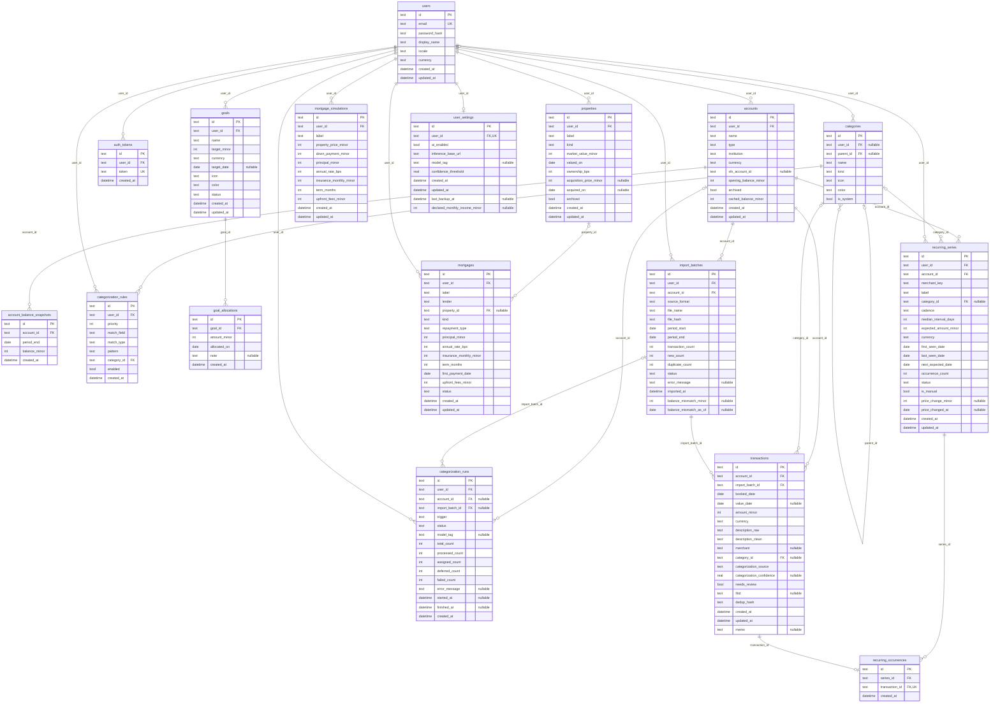

# Database schema

<!-- Generated by `backend/scripts/schema_doc.py` from a freshly migrated database.
     Do not edit by hand: run `uv run python -m scripts.schema_doc` from `backend/`. -->

> [!NOTE]
> Generated from the Alembic migrations at head, so it always matches the real schema. The
> conventions and the reasoning behind each table live in [`PROJECT.md`](../PROJECT.md) §4.

Conventions visible below: primary keys are UUID strings, money columns end in `_minor`
(signed integer minor units), rates end in `_bps` (integer basis points), and timestamps are
UTC.

## Entity-relationship diagram

## Constraints

### `account_balance_snapshots`

- unique `(account_id, period_end)`

### `accounts`

- unique `(user_id, ofx_account_id)`

### `goal_allocations`

- `goal_id` → `goals` on delete cascade

### `import_batches`

- unique `(account_id, file_hash)`

### `mortgages`

- check `kind IN ('mortgage', 'works', 'consumer', 'auto')`
- `property_id` → `properties` on delete set null

### `recurring_occurrences`

- `transaction_id` → `transactions` on delete cascade

### `recurring_series`

- unique `(account_id, merchant_key)`

### `transactions`

- unique `(account_id, fitid)`
